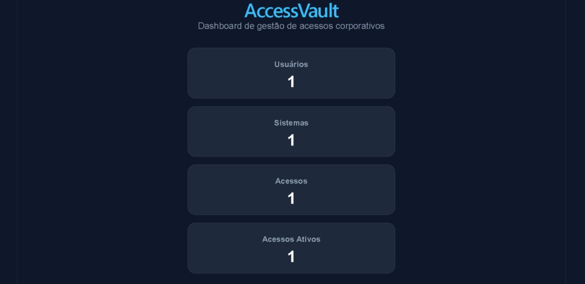

# AccessVault

Sistema web de gestão de acessos, credenciais e solicitações internas, com foco em segurança, organização e rastreabilidade.

## Visão geral

O **AccessVault** é um projeto full stack criado para centralizar o controle de usuários, sistemas corporativos e permissões de acesso em um único ambiente.  
A aplicação permite cadastrar usuários, registrar sistemas, conceder acessos e visualizar um resumo executivo por meio de dashboard.

## Preview



## Funcionalidades

- Cadastro de usuários
- Listagem de usuários com filtros
- Edição de usuários
- Desativação lógica de usuários
- Login de usuário
- Cadastro de sistemas
- Listagem de sistemas com filtros
- Edição de sistemas
- Desativação lógica de sistemas
- Cadastro de acessos entre usuários e sistemas
- Listagem de acessos com filtros
- Edição de acessos
- Revogação lógica de acessos
- Dashboard com resumo geral da operação

## Tecnologias utilizadas

### Backend
- Python
- FastAPI
- SQLAlchemy
- SQLite
- Pydantic

### Frontend
- React
- Vite
- CSS

### Versionamento
- Git
- GitHub

## Estrutura do projeto

```bash
AccessVault/
├── backend/
│   ├── app/
│   │   ├── core/
│   │   ├── database/
│   │   ├── models/
│   │   ├── routes/
│   │   ├── schemas/
│   │   └── main.py
│   └── requirements.txt
├── frontend/
│   ├── src/
│   ├── public/
│   ├── package.json
│   └── vite.config.js
└── README.md
```

## Como executar o projeto

1. Clonar o repositório
```
git clone <URL_DO_REPOSITORIO>
cd AccessVault
```
2. Rodar o Backend
```
cd backend
python -m venv venv
venv\Scripts\activate
pip install -r requirements.txt
py -m uvicorn app.main:app --reload
```
Backend disponível em:
```
http://127.0.0.1:8000
```
Documentação Swagger:
```
http://127.0.0.1:8000/docs
```
3. Rodar o frontend
Em outro terminal:
```
cd frontend
npm install
npm run dev
```
Frontend disponível em:
```
http://localhost:5173
```

## Endpoints principais

# Usuários:

- GET /users/
- GET /users/{user_id}
- POST /users/
- PUT /users/{user_id}
- DELETE /users/{user_id}

# Auth:
- POST /auth/login

# Sistemas:
- GET /systems/
- GET /systems/{system_id}
- POST /systems/
- PUT /systems/{system_id}
- DELETE /systems/{system_id}

# Acessos:
- GET /accesses/
- GET /accesses/{access_id}
- POST /accesses/
- PUT /accesses/{access_id}
- DELETE /accesses/{access_id}

# Dashboard:
- GET /dashboard/summary


## Status do projeto

Projeto em evolução, com backend funcional, frontend inicial integrado e estrutura preparada para novas melhorias.

## Melhorias futuras

- Autenticação com JWT
- Controle de acesso por perfil
- Formulários completos no frontend
- Interface administrativa mais avançada
- Deploy do backend e frontend
- Dashboard com gráficos
- Busca e filtros visuais
- Paginação

## Autor

- Paulo Henrique de Melo Bezerra
<<<<<<< HEAD
- GitHub: phmbezerra
=======
- GitHub: phmbezerra
>>>>>>> ec1d03b56517da020390739f87e878da0823c72c
